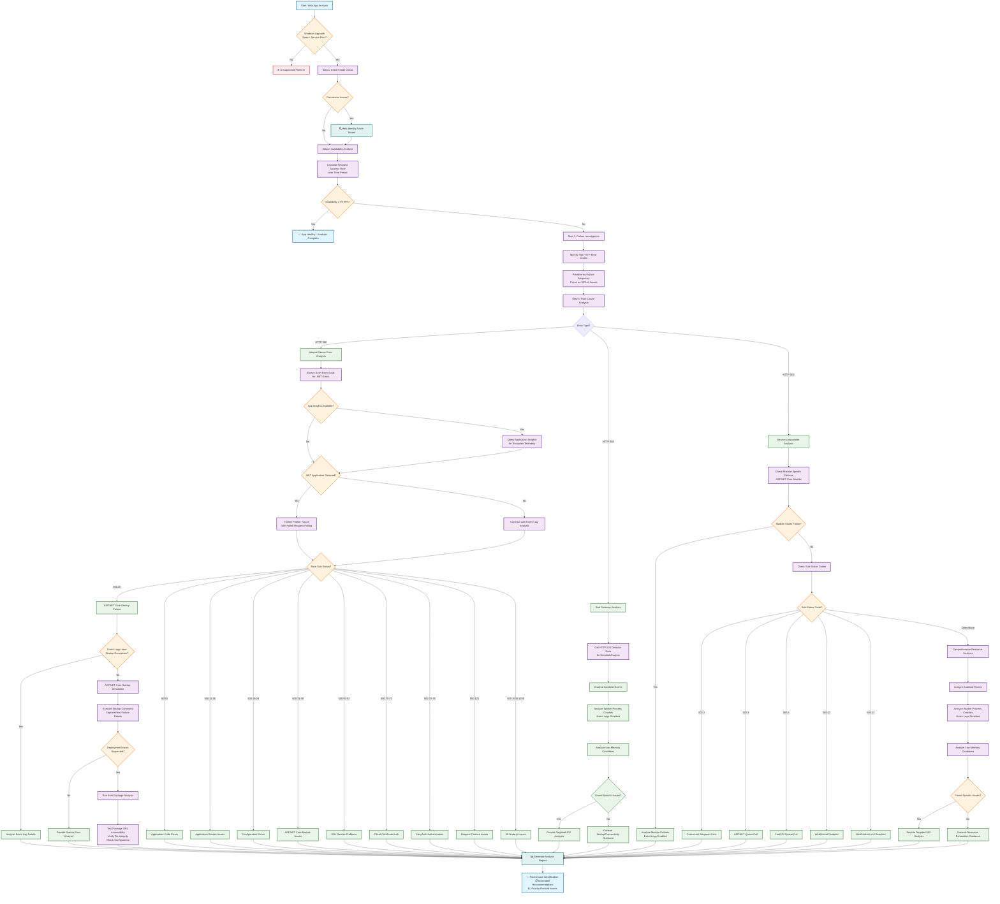
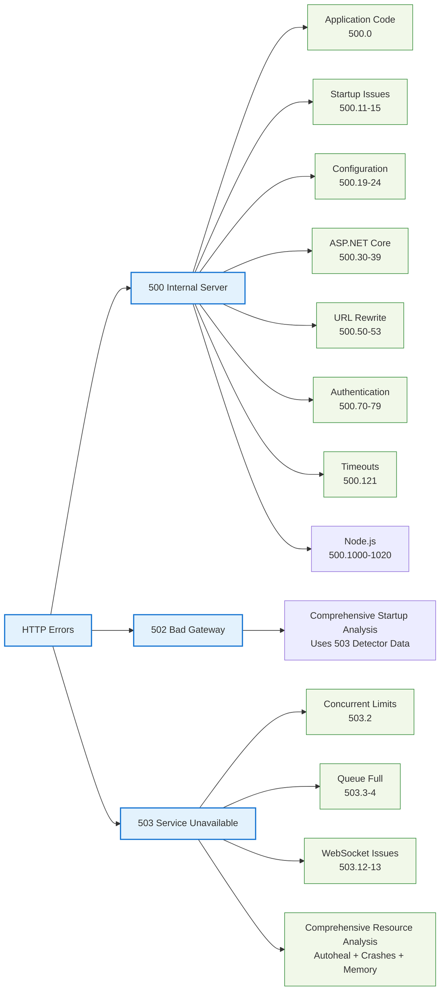

# Windows Web App Diagnostic Tool - Workflow Visualization

## Diagnostic Flow Chart

## Data Collection Timeline

```mermaid
gantt
    title Data Collection and Analysis Process
    dateFormat X
    axisFormat %s
    
    section Health Check
    Platform Validation     :0, 5
    Permission Check        :5, 10
    
    section Availability Analysis
    Request Traffic Scan    :10, 30
    Success Rate Calculation :25, 35
    
    section Failure Investigation
    Error Code Identification :35, 45
    Priority Analysis        :40, 50
    
    section Data Collection (Parallel)
    Event Logs Scanning     :50, 80
    App Insights Query      :50, 70
    Profiler Trace Collection :60, 120
    Failed Request Polling  :60, 120
    
    section Special Analysis
    ASP.NET Core Simulation :80, 100
    Package Deployment Check :85, 105
    
    section Report Generation
    Root Cause Analysis     :120, 140
    Recommendations         :135, 150
```

## Error Classification Matrix

## Key Features

### 🎯 **Smart Decision Making**
- Automatic platform validation
- Availability-based analysis depth
- Priority-focused investigation

### 🔍 **Multi-Source Analysis**
- Event Logs scanning (configurable depth)
- Application Insights integration
- Profiler trace collection
- Real-time failure monitoring
- **Autoheal events analysis** for automatic restart detection
- **Worker process crash analysis** with conditional event log scanning
- **Low memory condition monitoring** for resource exhaustion

### 🛠️ **Specialized Tools**
- ASP.NET Core startup simulation
- Run from Package deployment analysis
- Failed request polling
- Cross-tenant resource detection
- **Comprehensive HTTP 502/503 analysis** with SharedAnalyzer integration
- **Prioritized diagnostic flow** preventing duplicate analysis

### 📊 **Comprehensive Coverage**
- 20+ HTTP sub-status codes
- .NET application focus
- Deployment issue detection
- Authentication problem analysis
- **WebSocket-specific diagnostics** (503.12, 503.13)
- **Resource exhaustion analysis** (autoheal, crashes, memory pressure)
- **Module-specific failure detection** (ASP.NET Core Module)

### ⚡ **Current Limitations**
- Performance issues not yet supported
- Focus on availability over latency
- **Note**: HTTP 502/503 analysis now includes comprehensive resource analysis through SharedAnalyzer integration

---

*This diagram shows the complete diagnostic workflow. GitHub will render these Mermaid diagrams automatically when viewing the markdown file.*
